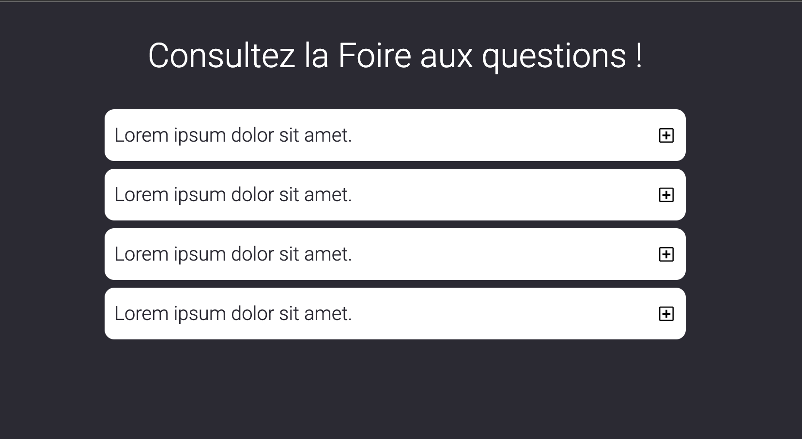

# Nettoyage du code html et mise en forme css
## Rendu :
###  [Lien vers le rendu](https://lahuts.github.io/faq/)

## Html :
- Nettoyage du code html , afin d'avoir un balisage sémantique
convenable.
## Css :
- Réalisation de la css à partir des classes fournis au préalable sur le document html.

## JavaScript :
- Réalisation du JavaScript afin de pouvoir cliquer sur un le bouton + est d'afficher son contenu .

## Note : 
 - Mise en place d'une classe en Js pour pratiquer.
 - Animations Css perso , n'etant pas fournis dans le projet.
 -  Typographie différente n'etant pas fournis dans le projet.

## Fonts :
 - Roboto light 300 disponible sur : [Google Fonts](https://fonts.google.com/specimen/Roboto?query=roboto)

 

## W3C Validator
[W3C Validator](https://validator.w3.org/nu/?doc=https%3A%2F%2Flahuts.github.io%2Ffaq%2F)
